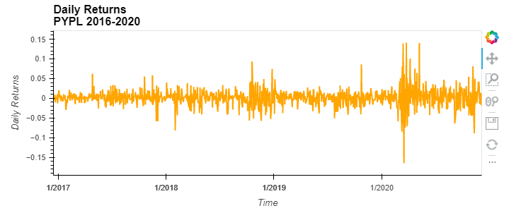
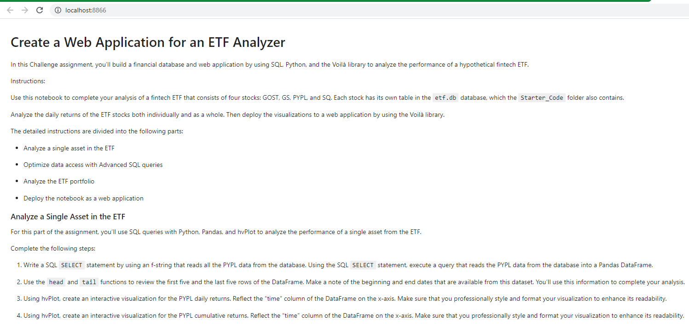

# fintech_challenge_7
This program builds a temporary database and populates it with the 'etf.db' database by utilizing SQL. The program then analyzes the PYPL ETF and provides visualizations of daily and cumulative return. After this, the rest of the portfolio is analyzed (PYPL, GDOT, GS, SQ) and a stacked cumulative return visualization is provided. Finally, Voila is used to display the results in a web browser window.

---
## Technologies
This program utilizes Jupyter Lab with the following libraries:

---
## Installation Guide
The only requirements are installing the required libraries and you must have the 'etf.db' file contained in the same folder as the python program itself.

---
## Usage
First, the program will establish a connection in order to import data from the 'etf.db' database.

Next, the daily returns for PYPL is calculated and visualized as a line plot.

The application then provides us with a cumulative return of PYPL visualization.

Now, the program displays the cumulative return of the entire ETF, which includes PYPL, GDOT, GS and SQ.

Finally, we use voila to review our results in a browser window. Simply use your terminal to navigate to the project folder, type 'voila etf_analyzer.ipynb' and... VOILA

---
## Contributors
Kevin Gross

---
## License
This program is covered under the MIT license.